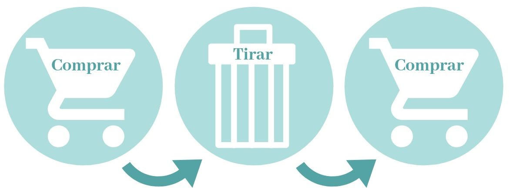
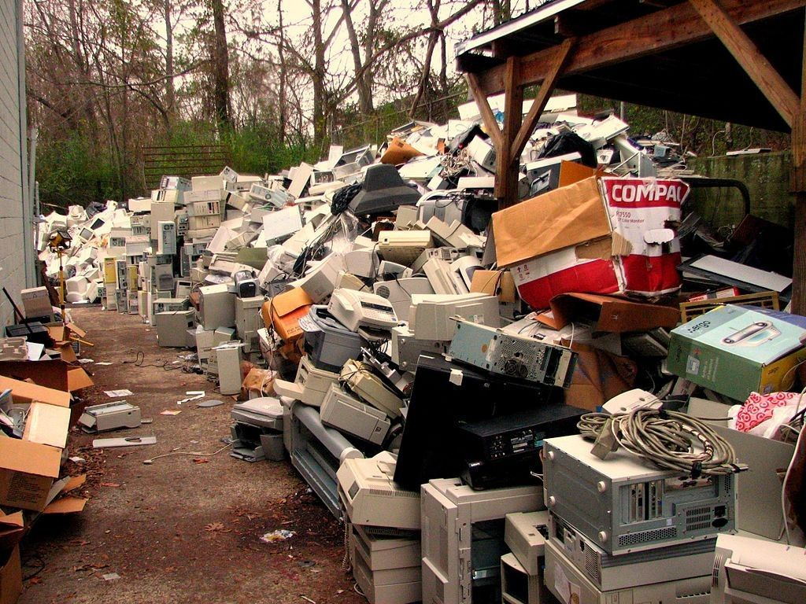

# OBSOLESCENCIA PROGRAMADA

Seguro que te has dado cuenta de que el jersey que te compraste hace 3 meses no luce igual que ese de tu abuela que te quedaste porque te encantó su rollo vintage.

El de tu abuela no tiene bolitas, abriga que da gusto y tiene las costuras fuertes. El que te compraste hace unas semanas ya tiene desperfectos y lo has usado unas 3 veces, dudas de que vaya a durar mucho en tu armario.
Eso es lo que se llama **obsolescencia programada**

## Que es la obsolescencia programada

La obsolescencia programada es cuando un producto tiene una fecha limite para que empiece a dar fallos ya que la empresa que lo vende lo ha hecho asi para que pagues por uno nuevo o por la reparacion.

El objetivo de esta práctica no es crear **productos de calidad**, sino exclusivamente el lucro económico, no teniéndose en cuenta las necesidades de los consumidores, ni las repercusiones medioambientales en la producción y mucho menos las consecuencias que se generan desde el punto de vista de la acumulación de residuos y la contaminación que conllevan.

Uno de los casos más conocidos son las impresoras que presentan fallos continuos. Se descubrió que incorporan un chip integrado que provoca que, en una fecha específica, comiencen a tener problemas, obligándote a solicitar un repuesto o una reparación que debes costear tú mismo.

>La obsolescencia programada solo sirve a las empresas para ganar mas dinero y contaminar mas de lo necesario

---

## Referencias

https://acortar.link/1fp9ma

https://dudialab.com/?p=1848

---

## Autor

Documentado por Ildefonso Sanchez Romero

